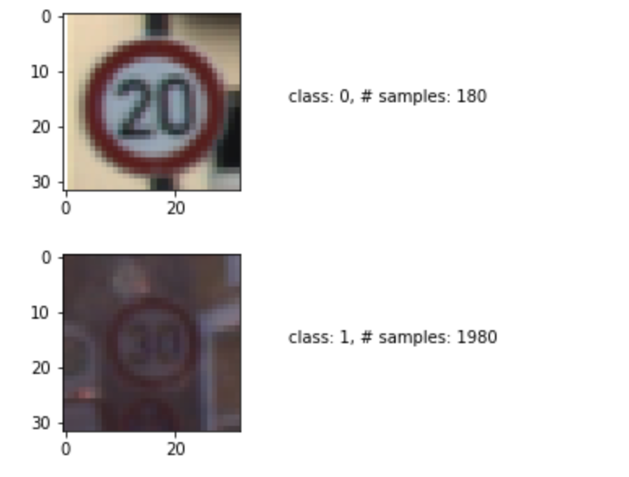

German Traffic Sign Recognition Project
=====

The goal of this project is to create a Convolutional Neural Network that is capable of classifying German traffic signs at high accuracy.

Summary Of Results
-----
 * Used Tensorflow to create and train a Convolutional Neural Network (CNN) model that is capable of classifying German traffic signs.
 * The final model could successfully classify 100% of the training data, 95.8% of the validation data, and 93.3% of the test data.
 * The model could correctly classify 6 out of 7 traffic signs found on the web.

Project workflow
-----
1. Load German traffic sign image data.
1. Inspect sample images.
1. Preprocesss data.
1. Select a base Covolutional Neural Network architecture.
1. Tweak parameters to find the best model.
1. Classify real-world examples with the best model.
1. Find new traffic sign images from the web
1. Predict sign type and analyze performance
1. Show Softmax probability to access model certainty.

Loading Data of German traffic sign images
-----
German traffic sign images were obtained from this URL: https://d17h27t6h515a5.cloudfront.net/topher/2017/February/5898cd6f_traffic-signs-data/traffic-signs-data.zip.

#### Data Characteristics:
* Format of the data: Pickled Python data
* Number of samples:
  * Training samples: 34799
  * Validation samples: 4410
  * Test samples: 12630
* Number of classes: 43
* Image shape:
  * Width: 32 pixels
  * Height: 32 pixels
  * Color channels: RGB

The code for this step is contained in the first and second cells of the IPython notebook.

Inspecting sample images
-----
I grouped training samples by class first, and then draw the first image of each class with the number of samples in the class as a caption. The result looks like this:

Some classes have as many as ten times more samples than others. This sample imbalance may not be an issue, depending on if the relative frequency of samples reflects how frequently those traffic signs are encountered on the German roads.

Preprocessing data
-----
I tried three different preprocessing methods. Here is the result:

| Preprocessing Method	| Training Accuracy | Validation Accuracy |
|:---------------------|------------------:|-----------------:| 
| No preprocessing     	| 0.9965802  |0.9455782
| Normalize each color channel  | 0.9968101  |0.9444444 
| Grayscale and then normalize|0.9999999  |0.9473922

The classification accuracies are largely similar (all within 0.3% in validation accuracy). I decided to apply grayscaling and normalization to samples for the following reasons:

1. Grayscaling reduces the number of color channels from three to one, which should quicken training.
2. Normalization for numerical stability.

I did not try any other preprocessing methods.

The code for this step is contained in the fourth code cell of the IPython notebook.

Select a base Covolutionan Neural Network architecture
-----
By imitating the model architecture described in this [paper by LeCun](http://yann.lecun.com/exdb/publis/pdf/sermanet-ijcnn-11.pdf), I chose the following as my base.

| Processing Layer      |  Description                               | Output Dimension (WxHxD)
|:----------------------|:-------------------------------------------|:------------------------
| Input                 | Normalize Grayscale image                  | 32x32x1
| Convolution           | 5x5 filter size, 1x1 stride, valid padding | 28x28x108
| RELU                  |                                            | 28x28x108
| Max pooling           | 2x2 filter size, 2x2 stride                | 14x14x108
| Convolution           | 5x5 filter size, 1x1 stride, valid padding | 10x10x108
| RELU                  |                                            | 10x10x108
| Max pooling           | 2x2 filter size, 2x2 stride                | 5x5x108
| Fully connected       |                                            | 100
| RELU                  |                                            | 100
| Fully connected       |                                            | 43

This model produced a respectable 96% validation accuracy. The next step is to find non-default values for model and training parameters that achieve higher validation accuracies.

The code for this step is contained in the 5th an 15th code cell of the IPython notebook. 

Tweak model and training parameters for improvement
-----
I have made the following model and training parameters easily modifiable from the code.

| Parameter                           | Meaning                                           | Type                | Base (default)
|:------------------------------------|:--------------------------------------------------|:--------------------|---------------------
| Sigma                               | Standard deviation of initial values for weights  | Float               | 0.1
| Convolution layer output depths     | Output depths of convolution layers               | Vector of integers  | [ 108, 108 ]
| Fully connected layer output depths | Output depths of fully connected layers           | Vector of integers  | [100, 43 ]
| Convolution layer filter size       | Size (width, height) of filter used in conv layers| Integer             | 5
| Learning rate                       | Learning rate for stochastic gradient decent      | Float               | 0.001
| Batch size                          | Number of train samples fed into trainer in a batch| Integer            | 100

(I also made *Epoch* modifiable, but decided to use the value of 30 throughout since I found it to be the "sweet spot" for the data set.)

A train-and-test pipeline does the following:

1. Take a set of the default parameter values.
2. Apply a tweak to it. 
1. Create a model from the tweaked set (sigma, conv. layer depths, full depths, and conv. layer filter size).
1. Train the model using the tweaked set (learning rate and batch size).
1. Calculate train and validation accuracies.

Due to time constraints, each run changes only one parameter at a time. If those parameters are largely independent of each other, the best combination of parameters can be found this way. Interestingly and unfortunately, the assumption did not turn out to be true. Using the parameter values that individually produced the best result did not produce a better result than the default does when used simultaneously!

The following table shows all values tried and the one that produced the best validation accuracy for each parameter.

| Parameter                           | Trail Values                                                  | Optimal Value
|:------------------------------------|:--------------------------------------------------------------|------------------------
| Sigma                               | 0.015, 0.025, 0.05, 0.075, 0.1 (default), 0.15, 0.2           | 0.1
| Convolution layer output depths     | [27], [54], [108], [216], [27,27], [54,54], [216,216], [27,54], [54,108], [108, 108] (default), [108,216] | [108, 216]
| Fully connected layer output depths | [43], [25,43], [50,43], [150,43], [100, 43] (default), [200,43], [400,43], [200,100,43] | [ 50, 43 ]
| Convolution layer filter size       | 3, 4, 5 (default), 6, 7, 8, 9                                 | 7
| Learning rate                       | 0.00025, 0.0005, 0.00075, 0.001 (default) 0.002, 0.005, 0.0075, 0.01 | 0.0075
| Batch size                          | 5, 10, 15, 25, 50, 100 (default), 200, 400                    | 100

With the optimal parameter values, the CNN model produced the following result:

| Accuracy     | Value
|:-------------|-------------:|
| Train        | 1.000000000
| Validation   | 0.958730159
| Test Accuracy| 0.933174980

Interestingly, the validation accuracy of this model is slightly less than that of the default model (0.96). It seems like multiple parameters must be tweaked simultaneously to find a truly best set of values.

The code for this step is contained in the 12th and 15th cells of the IPython notebook.

Find new images from the web
-----
Using Google image search, I found the following seven images of German traffic signs. 

| Image File     | Class (numerical) | Class (descriptive) | Image | 
|:-------------|-------------:|----|
| 18_General_caution.jpg | 18 | General caution |  
| 11_Right-of-way_at_the_next_intersection.jpg | 11 | Right of way at the next intersection | 
| 22_Bumpy_road.jpg | 22 | Bumpy road | 
| 12_Priority_road.jpg | 12 | Priority road | 
| 7_Speed_limit_100km | 7 | Speed limit (100km/h) | 
| 25_Road_work.jpg| 25 | Road work | 
| 17_No_entry.jpg | 17 | No entry |

I manually cropped a square (or near-square) area from each original image to extract an image of the sign. Then, each cropped image was scaled to a 32-by-23 squre in the code.

The code for this step is contained in the 27th code cell of the IPython notebook.

Predict sign types and analyze the result
-----
Here is the prediction result for each image

| Image File     | Class | Predicted Class | Predicted Correctly?
|:-------------|-------------:|----:|--|
| 18_General_caution.jpg | 18 | 18 | Yes
| 11_Right-of-way_at_the_next_intersection.jpg | 11 | 11 | Yes
| 22_Bumpy_road.jpg | 22 | 22 | Yes
| 12_Priority_road.jpg | 12 | 12| Yes
| 7_Speed_limit_100km | 7 | 7 | Yes
| 25_Road_work.jpg| 25 | 20 | No
| 17_No_entry.jpg | 17 | 17 | Yes

The prediction accuracy is 0.857 (6 out of 7), which is consistent with the test accuracy (0.93) considering the small sample size.

The code for this step is contained in the 38th and 43rd code cells of the IPython notebook.

Examine Softmax probability to assess model certainty
-----
Here is the Top 5 Softmax Probabilities for each image.

|ID  | Image File     | Top 5 Softmax Probabilities |
|- |:-------------|-------------|
|1| 18_General_caution.jpg | 0.98923737, 0.0075170849, 0.0010561987, 0.00058837538, 0.00053443911
|2| 11_Right-of-way_at_the_next_intersection.jpg | 0.63091481, 0.29112715, 0.040192511, 0.0091596926, 0.0070408303
|3| 22_Bumpy_road.jpg | 0.609061, 0.09793289, 0.093238771, 0.038194761, 0.03717659
|4| 12_Priority_road.jpg | 0.81723338, 0.04249974, 0.028294267, 0.024100691, 0.017840534
|5| 7_Speed_limit_100km | 0.2193782, 0.18528348, 0.18423812, 0.14477143, 0.14436412
|6| 25_Road_work.jpg| 0.30021745, 0.20760967, 0.12932085, 0.10165406, 0.044161469
|7| 17_No_entry.jpg | 0.81507403, 0.056803644, 0.029988268, 0.018493807, 0.011494351

I have divided logits by 10 before calculating Softmax probabilities to avoid overflow.

From these probabilities, we can see the model is pretty confident about its predictions for Image 1, 2, 3, 4, 7 while it is not for Image 5 and 6.

The code for this step is contained in the 78th code cell of the IPython notebook.
